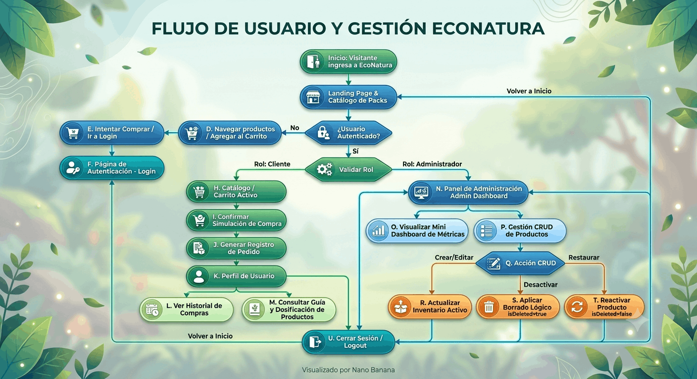

## EcoNatura - Tienda de Productos Naturistas

---

## 1. Visión General del Producto
**EcoNatura** es una plataforma web e-commerce diseñada para la comercialización de productos y packs naturistas. La plataforma facilita tanto la experiencia de compra simulada e informativa para el consumidor final como la gestión operativa y analítica para el administrador del negocio.

### 1.1. Objetivos de Negocio
* **Promover el consumo saludable:** Presentar productos y combos promocionales de manera clara y atractiva.
* **Fidelizar clientes:** Ofrecer una guía de uso personalizada y transparente para los productos adquiridos.
* **Simplificar la gestión interna:** Proveer un panel de administración intuitivo con control total de catálogo sin pérdida de historial comercial (borrado lógico).

---

## 2. Perfiles de Usuario (Roles)
* **Cliente / Usuario Registrado:** Navega por la tienda, simula compras de productos/packs y consulta la guía de dosificación y beneficios de sus productos.
* **Administrador:** Gestiona el inventario (CRUD con borrado lógico), visualiza métricas clave del negocio y supervisa productos activos e inactivos.

---

## 3. Requerimientos Funcionales (RF)

### RF-01: Landing Page & Promociones
* Presentación institucional de la marca y lema ecológico.
* Módulo destacado de **Packs Promocionales** (combos 2x1, descuentos por volumen).
* Acceso directo al catálogo general.

### RF-02: Carrito y Simulación de Compra
* Selección de productos y ajuste de cantidades.
* Cálculo en tiempo real del total a pagar.
* Simulación de checkout generando un registro histórico de pedido asociado al usuario.

### RF-03: Perfil de Usuario & Dashboard de Salud
* **Historial de pedidos:** Listado detallado de compras simuladas anteriores.
* **Guía interactiva de uso:** Ficha por producto comprado con modo de empleo, dosificación recomendada, beneficios y contraindicaciones.

### RF-04: Panel Administrativo & CRUD
* **Creación y Edición:** Registro y modificación de nombre, categoría y precio de productos.
* **Borrado Lógico (Soft Delete):** Desactivación/activación de productos sin eliminarlos físicamente para conservar métricas e historial de compras.

### RF-05: Mini Dashboard de Analítica
* Tarjetas de métricas cuantitativas clave:
  1. Monto Total de Ventas Simuladas.
  2. Cantidad de Productos Activos.
  3. Cantidad de Productos Desactivados (Borrado Lógico).
  4. Pack/Producto más vendido.

### RF-06: Control de Acceso y Sesión (Auth)
* Formulario de Login/Logout con distinción de roles (`user` vs `admin`).
* Restricción de acceso a rutas privadas según el rol autenticado.

---

## 4. Requerimientos No Funcionales (RNF)
* **Usabilidad:** Interfaz limpia, responsiva (móvil y escritorio) e intuitiva.
* **Integridad de Datos:** Conservación de datos históricos mediante borrado lógico.
* **Navegación Fluida:** Transición entre secciones sin recargas completas de pantalla (SPA).

---

## 5. Framework PEAS (Performance, Environment, Actuators, Sensors)

| Componente | Definición y Aplicación en EcoNatura |
| :--- | :--- |
| **Performance (Métricas de Desempeño)** | • Tasa de conversión simulada (% de visitantes que completan una compra).<br>• Rotación de packs promocionales.<br>• Precisión del inventario y ratio de productos activos vs. inactivos.<br>• Tiempo de sesión del usuario en la guía de uso de productos. |
| **Environment (Entorno)** | • Navegadores web en dispositivos móviles y de escritorio.<br>• Catálogo dinámico de productos naturistas y ofertas.<br>• Usuarios finales con diferentes necesidades de salud/bienestar y Administradores de tienda. |
| **Actuators (Actuadores / Respuestas)** | • Actualización reactiva del carrito y total de compra.<br>• Cambio de estado visible de productos (Activo / Borrado Lógico).<br>• Renderizado de paneles analíticos y métricas.<br>• Muestreo dinámico de guías de uso personalizadas según compras. |
| **Sensors (Sensores / Entradas)** | • Formularios de autenticación (Email / Password).<br>• Clics en botones de acción (Agregar al carrito, Simular compra, Desactivar producto).<br>• Entradas de texto y números en el formulario CRUD de administración.<br>• Selección de filtros de productos y navegación de rutas. |

---

## 6. Diagrama de Flujo del Sistema (Flowchart)



---

## 7. Diagrama de Flujo Textual / Estructurado

```bash
[INICIO: Visitante]
   │
   ├──> 1. LANDING PAGE
   │       ├── Ver Marcas y Packs Promocionales
   │       └── Explorar Catálogo General
   │
   ├──> 2. AUTENTICACIÓN (Login)
   │       ├── Credenciales Cliente ──> VISTA CLIENTE
   │       └── Credenciales Admin   ──> VISTA ADMINISTRADOR
   │
   ├──> 3. VISTA CLIENTE
   │       ├── Carrito ──> Simular Compra ──> Confirmación
   │       └── Perfil  ──> Historial de Pedidos
   │                   └── Guía de Uso, Dosificación y Beneficios
   │
   └──> 4. VISTA ADMINISTRADOR
           ├── Mini Dashboard ──> Ventas, Activos, Inactivos, Top Pack
           └── CRUD Inventario ──> Crear / Editar / Restaurar
                               └── Borrado Lógico (Desactivar)

```
